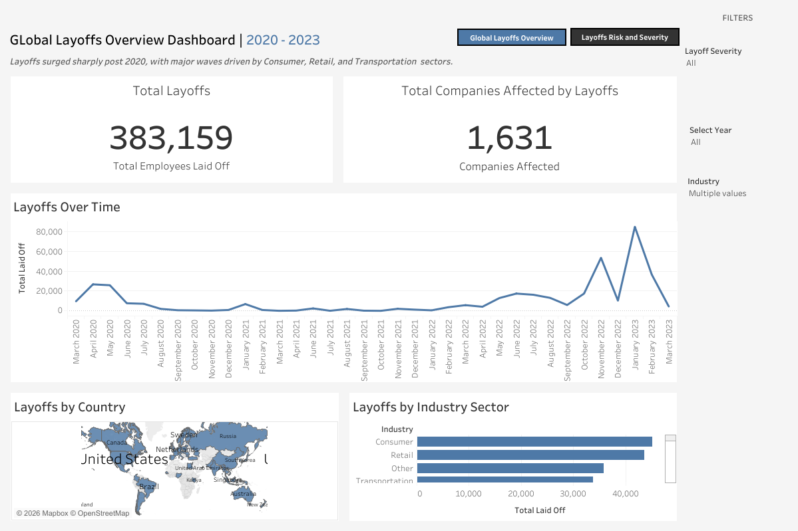
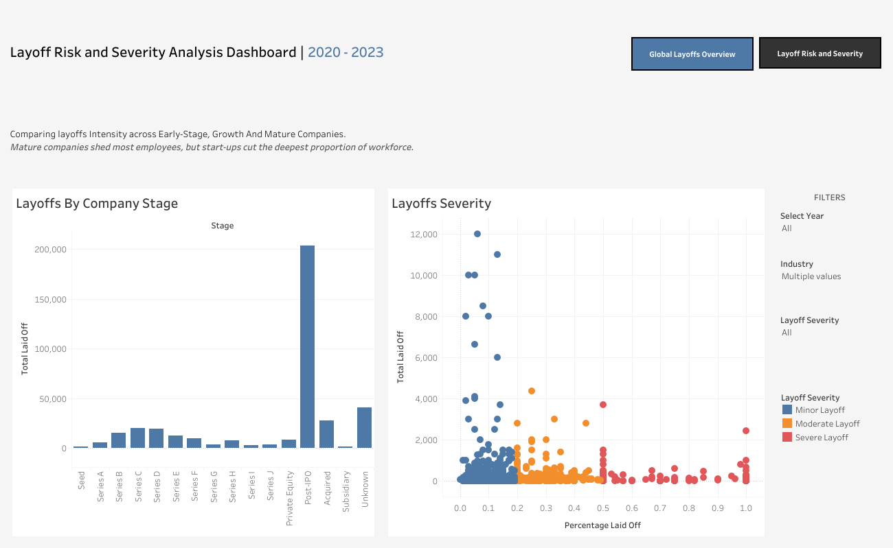

# Global-Layoffs-Analysis
SQL and Tableau project analyzing global layoff trends, industry risk, and workforce reduction severity.

---

# Global Layoffs Analysis: Industry Risk & Workforce Severity

##  Project Overview
This project analyzes global layoff data to identify workforce reduction trends,
industry risk exposure, geographic impact, and layoff severity across company stages.
The goal is to provide business and economic insights using data analytics and visualization.

##  Business Questions
- How have global layoffs changed over time?
- Which industries and countries are most affected?
- Are layoffs more severe in startups or mature companies?
- Do companies engage in minor cost-cutting or large workforce reductions?

##  Tools Used
- **SQL (MySQL):** Data cleaning, standardization, validation and exploratory analysis
- **Tableau Public:** Interactive dashboards and storytelling

##  Dashboard Structure
The analysis is presented using Tableau Storytelling:
1. **Global Layoffs Overview**
   - KPI cards (total companies affected, total employees laid off)
   - Layoffs over time
   - Layoffs by country | Layoffs by industry
     

2. **Layoff Severity & Company Analysis**
   - Layoffs by company stage | Layoff severity scatter analysis
   - Severity-based filtering

 ## Dashboard Preview
 
### Global layoffs Overview
 
 
---

 ### Layoffs Severity & Company Analysis

---

## Business Insights and Key Findings 

- Layoffs are concentrated in Consumer, Retail, Transportation and Other category which includes companies with unclear, mixed, or infrequently reported industry classifications in the source data. Its size highlights the limitations of industry standardization in global layoff data, The prominence of the "Other" category suggests that workforce risk extends beyond well defined industries, reinforcing the broad and systemic nature of layoffs. These sectors account for a disproportionate share of total layoffs, suggesting broad structural adjustments driven by funding slowdowns and cost pressures rather than isolated company issues.

- Layoff activity is geographically uneven, with a small number of countries contributing the majority of global layoffs. This reflects the concentration of venture capital, large technology firms, and startup ecosystems rather than global economic conditions alone.

- Late-stage and post-IPO companies account for the largest absolute layoffs, indicating that firms which expanded aggressively during favorable market conditions later reduced headcount to improve efficiency, margins, and profitability.

- Early-Stage companies workforce reduction is more severe than mature companies, it laid off a higher percentage of its workforce compared to mature companies.

- Two distinct layoff patterns emerge: low-severity layoffs associated with cost optimization and strategic restructuring, and high-severity layoffs that often signal financial distress, shutdowns, or major operational resets.

- Layoffs occur in noticeable time-based spikes, aligning with periods of economic uncertainty, post-pandemic market corrections, and tighter financial conditions, highlighting the cyclical nature of workforce reductions.

##  Tableau Public Link

https://public.tableau.com/app/profile/kabelo.makete/viz/WorldLayoffsDataAnalysis/GlobalLayoffsOverviewDashboard

##  Data Preparation
Data was cleaned in MySQL by removing duplicates, handling null values in critical fields,
standardizing categories, validating date and numeric formats before visualization in Tableau Public.

## Limitations

Spikes within the "Other" industry category reflect aggregation of unclassified or multi-sector companies rather than a single industry trend.

---

##  Contact

Kabelo Makete

Bcom Financial Management Graduate |

Aspiring Financial / Data Analyst

Linkedin: https://www.linkedin.com/in/kabelo-makete-68994b205/

